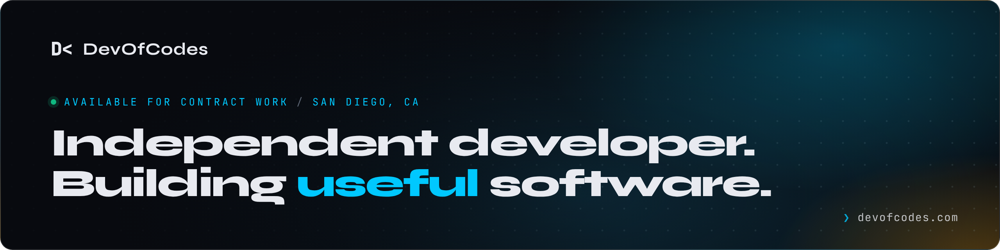

DevOfCodes is my one-person software company. This is where I share the products, tools and experiments I'm working on, and where you can hire me for **focused contract development**.

#### `❯ ls --status`

| | Project | What it is | Status |
|---|---|---|---|
| `01` | [**block-based-build-instructions**](https://devofcodes.com/#bbi) | AI-assisted design and build instructions for Minecraft | &nbsp;in&nbsp;development |
| `02` | [**dfs-command-center**](https://devofcodes.com/#dfs) | Research and portfolio workbench for DraftKings and FanDuel | &nbsp;in&nbsp;daily&nbsp;use |
| `03` | [**open-editor-platform**](https://devofcodes.com/open-editor.html) | A plan for an open-source editor SDK | &nbsp;research&nbsp;plan |
| `04` | [**devofcodes-platform**](https://devofcodes.com/#platform) | Multi-tenant foundation, Falcon on top | &nbsp;prototype |

4 projects · 0 customers · 1 person. The product repositories are private; [Landing](https://github.com/Dev-of-Codes-LLC/Landing) is the source for devofcodes.com.

#### Work with me

1. **Build a small web application, end to end.** Spec, data model, API, UI, auth, and a Docker deployment you can run anywhere.
2. **Turn a messy data workflow into a reliable pipeline.** Imports from awkward files, validation that opens issues instead of silently fixing things, provenance on every row.
3. **Finish or harden something you already have.** Authentication, multi-tenancy, background jobs, observability, tests and documentation.

A written scope with acceptance criteria, a fixed quote, work merged in units with its tests and docs, and you own the repository from day one. Built with .NET and TypeScript: ASP.NET Core, NestJS, React, PostgreSQL, Docker.

**[Discuss a project →](https://devofcodes.com/#contact)** &nbsp;·&nbsp; [hello@devofcodes.com](mailto:hello@devofcodes.com)

[devofcodes.com](https://devofcodes.com) · [Log](https://devofcodes.com/changelog.html) · [LinkedIn](https://www.linkedin.com/company/devofcodes/) · [X](https://x.com/DevOfCodes) · Max Wahlgren, San Diego, California
