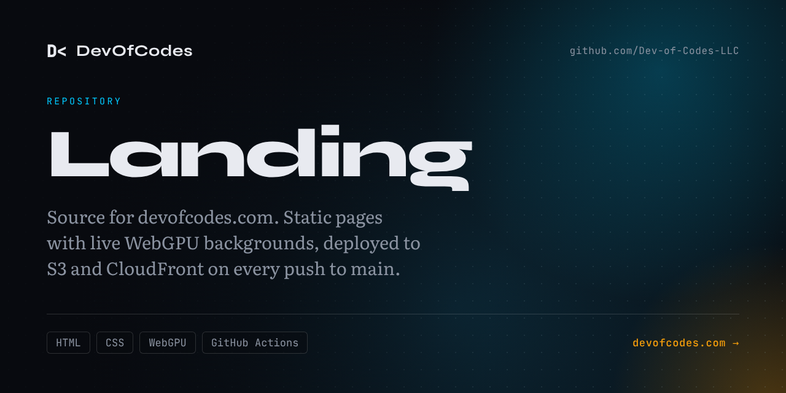

<a href="https://devofcodes.com"></a>

Source for [devofcodes.com](https://devofcodes.com), the site of DevOfCodes LLC. Plain HTML and CSS, no build step. Backgrounds are rendered live with WebGPU by the MIT [`shaders`](https://github.com/shader-effects-inc/shaders) library, with a CSS fallback under every surface.

## Layout

| Path | What it is |
|---|---|
| `index.html` | Home: intro, projects, work with me, contact |
| `about.html`, `changelog.html`, `open-editor.html` | About, the log, the Open Editor research plan |
| `privacy.html`, `terms.html` | Legal pages |
| `assets/site.css`, `assets/site.js` | Shared tokens, nav, reveals, contact form |
| `assets/shaders.js` | WebGPU presets, mounted lazily |
| `.github/workflows/deploy.yml` | Deploy to S3 and CloudFront |
| `.github/brand/` | GitHub avatar, banner and social previews, and the templates that render them |

## Preview

```sh
npx serve -l 4173 .
```

## Deploy

Every push to `main` syncs the site to S3 and invalidates CloudFront (see `.github/workflows/deploy.yml`). `main` takes changes through pull requests only. Markdown files, `.github/` and `.claude/` are never uploaded.
